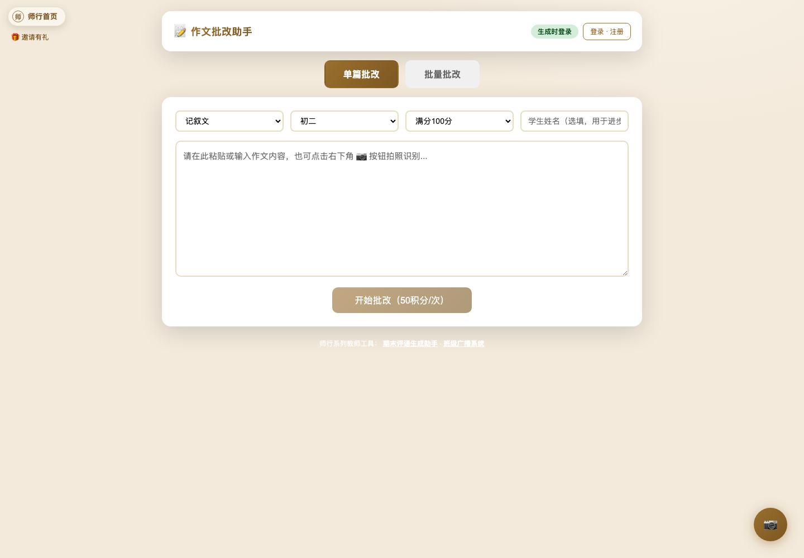
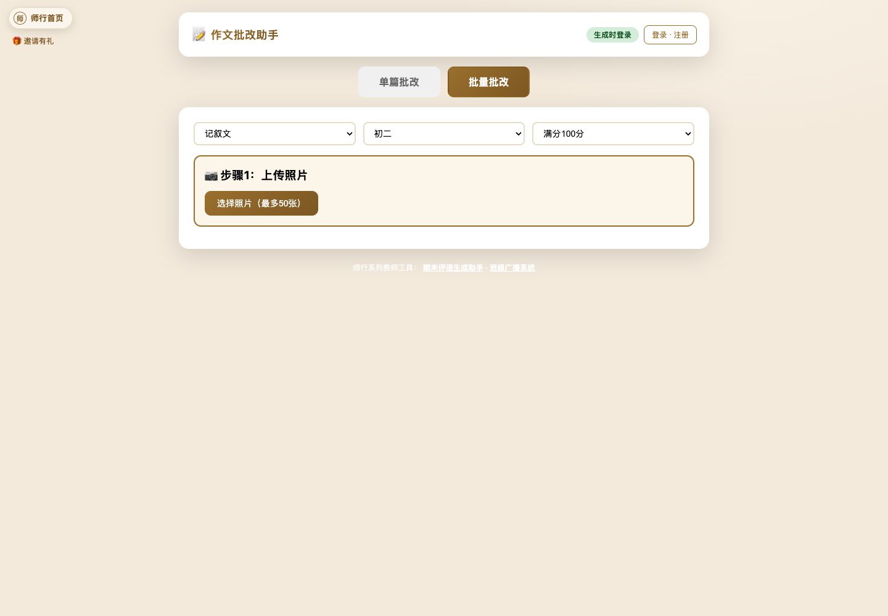
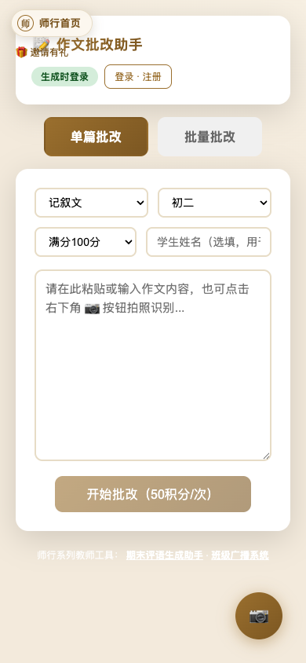

# 作文批改助手产品审阅（2026-07-13）

审阅对象：[https://zuowen.yingyuzuowen.asia/](https://zuowen.yingyuzuowen.asia/)

证据范围：未登录线上流程、桌面/手机界面、当前生产前端与后端代码。未登录真实教师账号，未执行会扣除积分的 AI 批改；结果区和历史区依据生产代码审阅。

## 一句话诊断

产品已经具备“输入作文 → AI 生成一份批改报告”的完整能力，但尚未成为老师的“作文批改工作台”。缺口主要在批改前的任务与量规、批改后的教师审核、学生返修、整班学情四段，因此使用者会感觉功能少。

## 当前已经具备的能力

- 单篇输入与拍照 OCR；支持文体、年级、分制和学生姓名。
- 批量上传最多 50 张照片、导入/保存学生名单、OCR 核对、暂停/继续、失败重试。
- 结构化结果：八维评分、雷达图、三种口吻评语、全文润色、逐段旁批、学生进步曲线。
- 批量导出 Excel、Word ZIP；单篇和历史记录导出 Word。
- 最近 50 条云端历史；统一账号、统一积分，生成时才要求登录。

## 流程审阅

### 1. 首次进入与单篇录入：基础健康

优点：核心表单一屏完成，50 积分成本在 CTA 上可见，未登录也可以先体验输入。

问题：页面只展示“填参数和正文”，没有作文题目、写作要求、教学目标、评分量规、重点关注项。AI 只能依据通用年级标准判断，难以贴合一次真实作业。

### 2. 批量批改：可用，但更像文件处理工具

优点：生产代码中已有五步流程、OCR 核对、名单复用、暂停、重试和批量导出，技术底座并不薄。

问题：入口只呈现“上传照片”，老师看不到完成批量批改后会得到什么；流程也没有“班级/作业”实体，无法把这批作文变成可持续复用的教学任务。

### 3. 生成时登录：健康

优点：保留了已输入作文，登录后可继续当前动作；注册与登录同处一层，统一账号说明明确。

问题：弹窗仍强调产品信息，缺少一句更直接的动作说明，例如“登录后继续批改，不会丢失已输入内容”。键盘焦点管理、Esc 关闭与焦点回归未从代码中确认。

### 4. 批改结果：信息丰富，缺少教师审核层

结果中已有八维评分、三种评语、润色、逐段旁批和趋势。但这些内容主要是只读展示；老师不能逐条接受、修改、删除 AI 判断，也不能把自己的常用评语沉淀成模板。高价值的“AI 初批 → 教师定稿”没有产品化。

### 5. 历史与复用：明显不足

历史是最近 50 条的平铺列表，主要动作是展开与导出。缺少按班级、作业、学生、日期、分数筛选；缺少重新打开编辑、复制为新作业、批量归档、删除与数据保留设置。现有进步曲线按同名学生归集，姓名错别字或重名会直接污染档案。

### 6. 手机端：可用，但有可见缺陷

- 左上“师行首页/邀请有礼”与主卡标题重叠。
- 学生姓名输入被压窄，placeholder 截断。
- 底部白色链接在米黄色背景上对比度很低。
- 固定相机按钮占用内容区域，较小屏幕上可能遮挡操作。

## 推荐的产品主线

不要继续横向堆“更多口吻、更多图表”。把产品升级为闭环：

**作业与量规 → 收作文/OCR → AI 初批 → 教师审核定稿 → 发给学生 → 学生返修 → 二次对比 → 班级讲评**

## 功能优先级

### P0：先补教师每天真正缺的四件事

1. **作文任务与评分量规**
   - 填写题目、材料、写作要求、字数、年级、满分。
   - 选择中考/高考/校本量规，或自定义评分维度及权重。
   - 设置本次重点：立意、细节描写、论证、结构、病句等。
   - 保存为模板并复用到整班。

2. **可编辑的教师审核工作台**
   - 左侧原文，右侧按原句锚定问题与建议。
   - 每条 AI 批注支持接受、修改、删除、降级为提示。
   - 总评、分数、维度分均可编辑；明确显示“AI 初批/教师已定稿”。
   - 保存老师常用评语，一键插入并形成个人评语库。

3. **班级与作业组织**
   - 以“班级—作业—学生作文”为主层级，不再只用最近 50 条平铺历史。
   - 支持筛选、搜索、未交/已批/待复核/已返还状态。
   - 重名学生使用学生 ID，而不是仅按姓名生成成长曲线。

4. **返还与二次修改闭环**
   - 生成学生专属链接或二维码，只看到自己的批改结果。
   - 学生提交修改稿；系统做原稿/修改稿差异对比。
   - 老师一屏查看“采纳了哪些建议、哪些问题仍存在”，再决定是否二批。

### P1：让批改结果直接服务教学

5. **整班讲评报告**
   - 分数分布、八维平均分、共性问题 Top 10。
   - 匿名好句/典型病句候选，老师确认后进入讲评课件。
   - 自动生成一页“下节作文课该讲什么”的教学建议。

6. **学生成长档案**
   - 按维度看长期变化，而不只看总分折线。
   - 记录反复出现的问题、已掌握能力、代表作和教师备注。

7. **批量质检台**
   - 标出 OCR 低置信、评分异常、重复评语、离群分数。
   - 老师只复核异常项，不必逐篇从头检查。

### P2：增强效率和可控性

8. 评分模板/评语库共享与导入导出。
9. 一键生成打印版批改单、班级讲评稿和家长沟通摘要。
10. 数据删除、保留期限、批量清理、隐私说明与学生信息脱敏。
11. 对接钉钉/企业微信/班级群只应在闭环稳定后考虑。

## 建议先做的版本

第一版不要一次铺满。建议只做：

1. 新增“作业题目 + 写作要求 + 本次评分重点”。
2. 结果页允许编辑分数、总评、逐条批注，并有“教师定稿”。
3. 引入班级/作业层级和状态筛选。
4. 生成学生查看链接，并支持提交一次修改稿。
5. 作业结束后生成整班共性问题和讲评摘要。

这五项连起来以后，产品定位会从“AI 给一份报告”变成“老师能完成整次作文教学”。

## 易用性与无障碍风险

- 两个模式切换使用 `div`，不是原生按钮，键盘用户无法可靠聚焦和触发。
- 文体、年级、分制和学生姓名缺少可见 label；只靠选项/placeholder 传达含义。
- 多处输入控件主动去掉 `outline`，只改变边框色，焦点可见性偏弱。
- 手机端重叠与低对比度是截图已确认的问题。
- 弹窗已有 `role=dialog`、`aria-modal` 和关闭按钮标签，这是正向基础；但焦点锁定、Esc 关闭、读屏顺序未做实际辅助技术测试，不能据此宣称完整无障碍。

